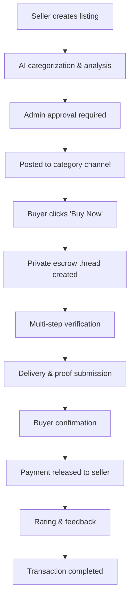

# 🚀 Discord Shop Bot - Railway Deployment

[](https://railway.app/template/your-template-id)

A comprehensive, enterprise-grade Discord marketplace bot with AI-powered features, secure escrow system, and advanced analytics. Built for scalability and deployed on Railway.

## ✨ Features Overview

### 🤖 AI-Powered Features
- **Smart Categorization**: Automatically categorizes items based on keywords
- **Auto-Tagging**: Intelligent tag generation for better discoverability  
- **Price Analysis**: Market trend analysis and pricing recommendations
- **Fraud Detection**: AI-powered scam prevention and anomaly detection

### 🔒 Secure Trading System
- **Multi-Step Escrow**: Secure transactions with proof requirements
- **Delivery Confirmation**: Buyer verification before payment release
- **Dispute Resolution**: Admin-mediated conflict resolution
- **Transaction Logging**: Complete audit trail for all transactions

### 📊 Advanced Analytics
- **Real-Time Metrics**: Live transaction and user statistics
- **Market Trends**: Price history and demand analysis
- **Performance Tracking**: Seller ratings and buyer activity
- **Automated Reports**: Daily insights and weekly summaries

### 🛡️ Security & Moderation
- **Anti-Scam System**: Pattern recognition and risk assessment
- **User Reporting**: Community-driven safety features
- **Admin Dashboard**: Comprehensive moderation tools
- **Automated Alerts**: Suspicious activity notifications

## 🚀 Quick Railway Deployment

### One-Click Deploy
1. Click the "Deploy on Railway" button above
2. Connect your GitHub account
3. Set your environment variables
4. Deploy automatically

### Manual Railway Setup

1. **Fork this repository** to your GitHub account

2. **Create a Railway project:**
   ```bash
   npm install -g @railway/cli
   railway login
   railway init
   railway link
   ```

3. **Set environment variables** in Railway dashboard:
   ```
   DISCORD_TOKEN=your_bot_token_here
   NODE_ENV=production
   DATABASE_PATH=/app/data/shopbot.db
   ```

4. **Deploy:**
   ```bash
   railway up
   ```

## 🛠️ Local Development Setup

### Prerequisites
- Node.js 18+ 
- SQLite3
- Discord Bot Token

### Installation

1. **Clone the repository:**
   ```bash
   git clone https://github.com/yourusername/discord-shop-bot
   cd discord-shop-bot
   ```

2. **Install dependencies:**
   ```bash
   npm install
   ```

3. **Environment setup:**
   ```bash
   cp .env.example .env
   # Edit .env with your bot token and configuration
   ```

4. **Initialize database:**
   ```bash
   npm run migrate
   ```

5. **Start development server:**
   ```bash
   npm run dev
   ```

## 📁 Project Structure

```
discord-shop-bot/
├── src/
│   ├── index.js              # Main entry point
│   ├── database/
│   │   └── Database.js       # SQLite database manager
│   ├── handlers/
│   │   ├── CommandHandler.js # Message command processing
│   │   ├── InteractionHandler.js # Button/modal interactions
│   │   └── EventHandler.js   # Discord event handling
│   ├── services/
│   │   ├── AIService.js      # AI categorization & analysis
│   │   ├── EscrowService.js  # Secure transaction management
│   │   ├── SecurityService.js # Anti-fraud protection
│   │   └── ScheduledTasks.js # Automated background tasks
│   └── utils/
│       └── Logger.js         # Centralized logging
├── data/                     # Database and persistent storage
├── railway.json              # Railway deployment config
├── package.json              # Dependencies and scripts
└── README.md                 # This file
```

## 🎮 Discord Bot Setup

### 1. Create Discord Application
1. Go to [Discord Developer Portal](https://discord.com/developers/applications)
2. Create a new application
3. Navigate to "Bot" section
4. Create a bot and copy the token
5. Enable these **Privileged Gateway Intents**:
   - Server Members Intent
   - Message Content Intent

### 2. Bot Permissions
Required permissions integer: `274877959168`

**Permissions needed:**
- Send Messages
- Use Slash Commands
- Manage Threads
- Create Private Threads
- Embed Links
- Use External Emojis
- Read Message History
- Add Reactions
- Manage Messages (for cleanup)

### 3. Invite Bot to Server
Use this URL (replace `CLIENT_ID` with your application ID):
```
https://discord.com/api/oauth2/authorize?client_id=CLIENT_ID&permissions=274877959168&scope=bot
```

## ⚙️ Configuration

### Environment Variables

| Variable | Description | Required | Default |
|----------|-------------|----------|---------|
| `DISCORD_TOKEN` | Bot token from Discord Developer Portal | ✅ | - |
| `DATABASE_PATH` | Path to SQLite database file | ❌ | `./data/shopbot.db` |
| `NODE_ENV` | Environment (development/production) | ❌ | `development` |
| `ADMIN_USER_IDS` | Comma-separated admin user IDs | ❌ | - |
| `MAX_LISTINGS_PER_USER` | Maximum listings per user | ❌ | `50` |
| `MAX_PRICE` | Maximum item price | ❌ | `10000` |
| `MIN_PRICE` | Minimum item price | ❌ | `0.01` |

### Bot Configuration Commands

After inviting the bot, configure it using admin commands:

```bash
# Set category channels
!admin setchannel roblox #roblox-shop
!admin setchannel skins #skins-marketplace  
!admin setchannel currency #currency-exchange
!admin setchannel rare #rare-items
!admin setchannel other #general-shop

# View configuration
!admin config

# Check bot statistics
!admin stats
```

## 🎯 Usage Guide

### For Sellers

1. **Create Listing:**
   ```
   !sell
   ```
   - Opens AI-powered listing form
   - Automatic categorization and tagging
   - Price analysis and recommendations
   - Admin approval required

2. **Manage Listings:**
   ```
   !mylistings
   ```
   - View all your active listings
   - Check status and performance metrics

### For Buyers

1. **Search Items:**
   ```bash
   !search roblox pet              # Text search
   !search category:roblox         # By category
   !search price:<50               # Under $50
   !search rating:>4               # High-rated sellers
   ```

2. **Purchase Items:**
   - Click "Buy Now" on any listing
   - Secure escrow thread is created
   - Follow the guided transaction process

3. **Track Purchases:**
   ```
   !history                        # Transaction history
   !wishlist                       # Saved items
   ```

### For Admins

1. **Moderation Dashboard:**
   ```
   !dashboard                      # Overview of pending actions
   !admin disputes                 # Active disputes
   !admin reports                  # User reports
   ```

2. **Analytics:**
   ```
   !admin stats                    # Marketplace statistics
   !leaderboard                    # Top sellers
   ```

## 🔄 Transaction Flow



## 📊 Database Schema

The bot uses SQLite with the following main tables:

- **listings**: Item listings with AI analysis
- **transactions**: Secure transaction records
- **user_ratings**: Seller reputation system
- **user_metrics**: User activity tracking
- **disputes**: Conflict resolution
- **reports**: Safety reporting
- **daily_stats**: Analytics data

## 🔧 API Endpoints (Future)

The bot is designed to support REST API integration:

```javascript
// Planned endpoints
GET  /api/listings              // Public listings
GET  /api/users/{id}/stats      // User statistics  
GET  /api/analytics/trends      // Market trends
POST /api/webhooks/transaction  // Transaction notifications
```

## 🛠️ Customization

### Adding New Categories

Edit `src/services/AIService.js`:

```javascript
this.categoryKeywords = {
    'minecraft': {
        keywords: ['minecraft', 'blocks', 'mods', 'server'],
        weight: 1.0
    },
    // ... existing categories
};
```

### Custom Badge System

Modify badge requirements in `src/handlers/InteractionHandler.js`:

```javascript
const badges = {
    CUSTOM_BADGE: { 
        name: '🏅 Custom Badge', 
        requirement: { sales: 25, rating: 4.8 } 
    },
    // ... existing badges
};
```

### Scheduled Tasks

Add custom automation in `src/services/ScheduledTasks.js`:

```javascript
// Custom daily task
const customTask = cron.schedule('0 12 * * *', () => {
    this.customDailyFunction();
});
```

## 🐛 Troubleshooting

### Common Issues

**Bot not responding:**
- Check bot token is correct
- Verify bot has necessary permissions
- Ensure Message Content Intent is enabled

**Database errors:**
- Check write permissions for data directory
- Verify SQLite3 is properly installed
- Check disk space availability

**Transaction issues:**
- Ensure bot can create private threads
- Check thread permissions in target channels
- Verify user permissions for thread access

**Railway deployment issues:**
- Check environment variables are set
- Verify database path is persistent (`/app/data/`)
- Check Railway logs for specific errors

### Debugging

Enable debug logging by setting `NODE_ENV=development`:

```javascript
// In your local .env file
NODE_ENV=development
DEBUG=true
```

## 📈 Performance Optimization

### Database Optimization
- Regular cleanup of old records
- Indexed queries for fast searching
- Connection pooling for high load

### Memory Management
- Automatic cache cleanup
- Efficient data structures
- Garbage collection monitoring

### Rate Limiting
- Built-in cooldown system
- API rate limit compliance
- Progressive backoff for retries

## 🔒 Security Features

### Data Protection
- Encrypted sensitive data storage
- Secure transaction processing
- Regular security audits

### Anti-Fraud System
- Pattern recognition algorithms
- Real-time risk assessment
- Automated suspicious activity detection

### Privacy Compliance
- GDPR-compliant data handling
- User data anonymization options
- Secure data deletion procedures

## 🤝 Contributing

1. Fork the repository
2. Create a feature branch
3. Make your changes
4. Add tests if applicable
5. Submit a pull request

### Development Guidelines
- Follow ESLint configuration
- Add JSDoc comments for new functions
- Update README for new features
- Test thoroughly before submitting

## 📄 License

This project is licensed under the MIT License - see the [LICENSE](LICENSE) file for details.

## 🆘 Support

### Getting Help
- **Documentation**: Check this README and code comments
- **Issues**: Create GitHub issues for bugs
- **Discord**: Join our support server (link in bio)
- **Email**: Contact team@shopbot.dev

### Professional Support
Enterprise support and custom features available:
- Custom integrations
- Advanced analytics
- Dedicated hosting
- 24/7 support

## 🎉 Acknowledgments

- Discord.js community for excellent documentation
- Railway for seamless deployment platform
- Contributors who helped improve the bot
- Beta testers from various Discord communities

## 📚 Additional Resources

- [Discord.js Guide](https://discordjs.guide/)
- [Railway Documentation](https://docs.railway.app/)
- [SQLite Documentation](https://www.sqlite.org/docs.html)
- [Discord Bot Best Practices](https://discord.com/developers/docs/topics/best-practices)

---

**Made with ❤️ for the Discord community**

> This bot represents the future of Discord marketplace automation - secure, intelligent, and user-friendly.

### 🔄 Version History

- **v2.0.0** - Railway deployment, AI features, enhanced security
- **v1.5.0** - Escrow system, dispute resolution
- **v1.0.0** - Basic marketplace functionality

### 🚀 Roadmap

- [ ] REST API integration
- [ ] Mobile app companion
- [ ] Multi-language support
- [ ] Advanced ML recommendations
- [ ] Cryptocurrency payments
- [ ] Cross-server trading network
